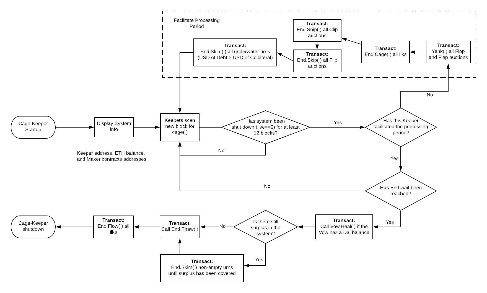

# cage-keeper


[](https://codecov.io/gh/makerdao/cage-keeper)

The `cage-keeper` is used to help facilitate [Emergency Shutdown](https://blog.makerdao.com/introduction-to-emergency-shutdown-in-multi-collateral-dai/) of the [Maker Protocol](https://github.com/makerdao/dss). Emergency shutdown is an involved, deterministic process, requiring interaction from all user types: Vault owners, Dai holders, Redemption keepers, MKR governors, and other Maker Protocol Stakeholders. A high level overview is as follows:
1. System Caged - The Emergency Security Module [(ESM)](https://github.com/makerdao/esm) calls `End.cage()` function, which freezes the USD price for each collateral type as well as many parts of the system.
2. Processing Period - Next, Vault owners interact with End to settle their Vault and withdraw excess collateral. Auctions are left to conclude or are yanked before Dai redemption.
3. Dai Redemption  - After the processing period duration `End.wait` has elapsed, Vault settlement and all Dai generating processes (auctions) are assumed to have concluded. At this point, Dai holders can begin to claim a proportional amount of each collateral type at a fixed rate.

To prevent a race-condition for Dai holders during Step 3, it's imperative that any Vaults having a collateralization ratio of less than 100% at Step 1 must be processed during Step 2. The owner of an underwater Vault would not receive excess collateral, so they lack an incentive to `skim` their position in the `End` contract. Thus, it is the responsibility of a MakerDao Stakeholder (MKR holders, large Dai holders, etc) to ensure the system facilitates a Dai redemption phase without a time variable. The `cage-keeper` is a tool to help stakeholders carry out this responsibility.

### Review
The following section assumes familiarity with Emergency Shutdown. Good places to start is the Emergency Shutdown Module in Section 3 and Section 4 of the [Maker Protocol 101](https://docs.makerdao.com/maker-protocol-101) as well as a more thorough, [technical description](https://docs.makerdao.com/smart-contract-modules/shutdown). Functions mentioned are from the implementation contained by the `End` contract, which is [located here](https://github.com/makerdao/dss/blob/master/src/end.sol).

To be consistent with the Protocol's technical terminology for the rest of this description:
* `urn` = Vault
* `ilk` = Collateral Type

## Architecture



`cage-keeper` directly interacts with the `End`, `Flopper` and `Flapper` contracts.

The central goal of the `cage-keeper` is to process all under-collateralized `urns`. This accounting step is performed within `End.skim()`, and since it is surrounded by other required/important steps in the Emergency Shutdown, a first iteration of this keeper will help to call most of the other public function calls within the `End` contract.

As can be seen in the above flowchart, the keeper checks if the system has been caged before attempting to `skim` all underwater urns and `skip` all flip auctions. After the processing period has been facilitated and the `End.wait` waittime has been reached, it will transition the system into the Dai redemption phase of Emergency Shutdown by calling `End.thaw()` and `End.flow()`. This first iteration of this keeper is naive, as it assumes it's the only keeper and attempts to account for all urns, ilks, and auctions. Because of this, it's important that the keeper's address has enough ETH to cover the gas costs involved with sending numerous transactions. Any transaction that attempts to call a function that's already been invoked by another Keeper/user would simply fail.


## Operation

Once the keys to an ethereum address are supplied at startup, the keeper works out of the box. It can either run continuously on a local/virtual machine or be run when the operator becomes aware of Emergency Shutdown. A sample startup script is shown below. When new collateral types are added to the protocol, the operator should pull the latest version of the keeper, which would include contracts associated with the aforementioned collateral types.

After the `cage-keeper` facilitates the processing period, it can be turned off until `End.wait` is nearly reached. Then, at that point, the operator would pass in the `--previous-cage` argument during keeper start in order to bypass the feature that supports the processing period. Continuous operation removes the need for this flag.

The keeper's ethereum address should have enough ETH to cover gas costs and is a function of the protocol's state at the time of shutdown (i.e. more Vaults to `skim` means more required ETH to cover gas costs). The following equation approximates how much ETH is required:
```
min_ETH = average_gasPrice * [ ( Flopper.yank()_gas * #_of_Flop_Auctions     ) +
                               ( Flapper.yank()_gas * #_of_Flap_Auctions     ) +
                               ( End.cage(Ilk)_gas  * #_of_Collateral_Types  ) +
                               ( End.skip()_gas     * #_of_Flip_Auctions     ) +
                               ( End.skim()_gas     * #_of_Underwater_Vaults ) +
                               ( Vow.heal()_gas                              ) +
                               ( End.thaw()_gas                              ) +
                               ( End.flow(Ilk)_gas  * #_of_Collateral_Types  ) ]
```

Here's an example from a recent Kovan test of the `cage-keeper`; note that the gasCost arguments in this example are conservative upper bounds, computed from `web3.eth.estimateGas()`, which calls the [eth_estimateGas JSON-RPC method](https://github.com/ethereum/wiki/wiki/JSON-RPC#eth_estimategas).
```
min_ETH = 15 GWei * [ ( 196605 * 1  ) +
                      ( 154892 * 1  ) +
                      ( 187083 * 3  ) +
                      ( 389191 * 3  ) +
                      ( 223399 * 30 ) +
                      ( 166397      ) +
                      ( 157094      ) +
                      ( 159159 * 3  ) ]
min_ETH = 15 GWei * 9583257
min_ETH ~= 0.1437 ETH
```


### Installation
#### Prerequisites
- [Python v3.6.6](https://www.python.org/downloads/release/python-366/)
- [virtualenv](https://virtualenv.pypa.io/en/latest/)
    - This project requires *virtualenv* to be installed if you want to use Maker's python tools. This helps with making sure that you are running the right version of python and checks that all of the pip packages that are installed in the **install.sh** are in the right place and have the right versions.

In order to clone the project and install required third-party packages please execute:
```
git clone https://github.com/makerdao/cage-keeper.git
cd cage-keeper
git submodule update --init --recursive
./install.sh
```

For some known Ubuntu and macOS issues see the [pymaker](https://github.com/makerdao/pymaker) README.


### Sample Startup Script

Make a run-cage-keeper.sh to easily spin up the cage-keeper.

```
#!/bin/bash
/full/path/to/cage-keeper/bin/cage-keeper \
	--rpc-host 'https://sample.ParityNode.com:8545' \
	--network 'kovan' \
	--eth-from '0xABCAddress' \
	--eth-key 'key_file=/full/path/to/keystoreFile.json,pass_file=/full/path/to/passphrase/file.txt' \
	--vat-deployment-block 14374534 \
  [--vulcanize-endpoint 'http://vdb.sampleendpoint.com:8545/graphql']
```


## Testing

Prerequisites:
* Download [docker and docker-compose](https://www.docker.com/get-started)

This project uses [pytest](https://docs.pytest.org/en/latest/) for unit testing.  Testing of Multi-collateral Dai is
performed on a Dockerized local testchain included in `tests\config`.

In order to be able to run tests, please install development dependencies first by executing:
```
pip3 install -r requirements-dev.txt
```

You can then run all tests with:
```
./test.sh
```

## Roadmap
- [ ]  Asynchronous Transactions for improved performance
- [ ]  Interactive startup (ask if cage has already been facilitated by the keeper)
- [ ]  Call `Vow.heal()` and `End.thaw()` atomically
- [ ]  Gas optimization (check to see if function has been called already, etc)


## License

See [COPYING](https://github.com/makerdao/auction-keeper/blob/master/COPYING) file.

### Disclaimer

YOU (MEANING ANY INDIVIDUAL OR ENTITY ACCESSING, USING OR BOTH THE SOFTWARE INCLUDED IN THIS GITHUB REPOSITORY) EXPRESSLY UNDERSTAND AND AGREE THAT YOUR USE OF THE SOFTWARE IS AT YOUR SOLE RISK.
THE SOFTWARE IN THIS GITHUB REPOSITORY IS PROVIDED “AS IS”, WITHOUT WARRANTY OF ANY KIND, EXPRESS OR IMPLIED, INCLUDING BUT NOT LIMITED TO THE WARRANTIES OF MERCHANTABILITY, FITNESS FOR A PARTICULAR PURPOSE AND NONINFRINGEMENT. IN NO EVENT SHALL THE AUTHORS OR COPYRIGHT HOLDERS BE LIABLE FOR ANY CLAIM, DAMAGES OR OTHER LIABILITY, WHETHER IN AN ACTION OF CONTRACT, TORT OR OTHERWISE, ARISING FROM, OUT OF OR IN CONNECTION WITH THE SOFTWARE OR THE USE OR OTHER DEALINGS IN THE SOFTWARE.
YOU RELEASE AUTHORS OR COPYRIGHT HOLDERS FROM ALL LIABILITY FOR YOU HAVING ACQUIRED OR NOT ACQUIRED CONTENT IN THIS GITHUB REPOSITORY. THE AUTHORS OR COPYRIGHT HOLDERS MAKE NO REPRESENTATIONS CONCERNING ANY CONTENT CONTAINED IN OR ACCESSED THROUGH THE SERVICE, AND THE AUTHORS OR COPYRIGHT HOLDERS WILL NOT BE RESPONSIBLE OR LIABLE FOR THE ACCURACY, COPYRIGHT COMPLIANCE, LEGALITY OR DECENCY OF MATERIAL CONTAINED IN OR ACCESSED THROUGH THIS GITHUB REPOSITORY.
